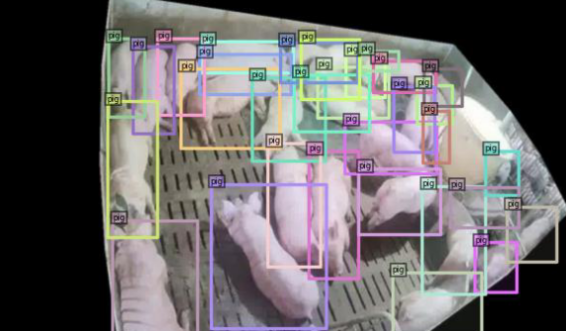
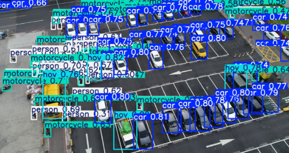
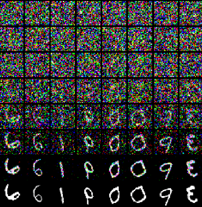
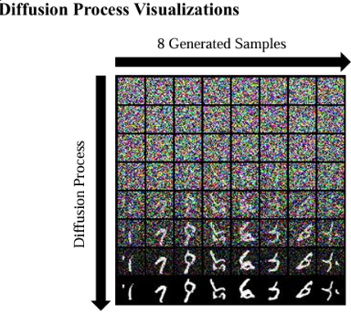
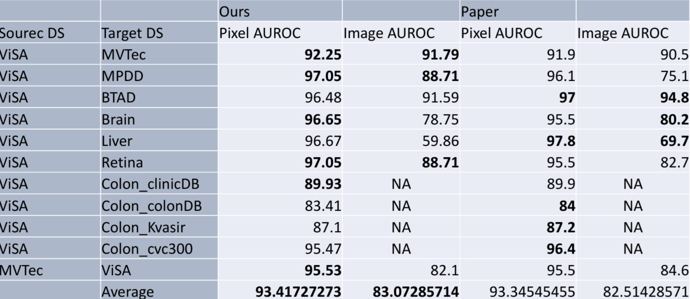

# NTU2025 Computer Vision Practice with Deep Learning
Computer vision has become deeply integrated into daily life, yet each application presents unique practical challenges. This course focuses on cutting-edge deep learning solutions within academic literature to build a robust theoretical foundation and practical expertise in computer vision.

## HW1 - Object Detection for Group-hosed Swine (Kaggle Competition)

**1. Dataset Description**
- Training set: 1266 images (including img/ & gt.txt)
- Testing set: 1864 images (including img/)
- Metric: Average Precision mAP50:95

**2. Training Strategies**
- Model: YOLOv8
- Training for sufficient epochs (200 epochs) in order to converge the loss and get a better performance. 
- Cosine Learning Rate Decay - for smooth learning rate reduction, promoting steady convergence and preventing overshooting during fine
tuning. 
- Fine-tuning – After training, I managed to adjust hyperparameters like max detections and confidence/iou threshold, to optimize the F1 score. 

**3. Kaggle Leaderboard Result**
- Rank: 209/509 (Include All TAICA students who come from different colleges)

## HW2 - Long-tailed object detection for drone-based intelligent counting (Kaggle Competition)

**1. Dataset Description**
- Training set: 950 images with 33,331 objects. Each image has a
corresponding gt.txt file (e.g. img0001.png, img0001.txt).
- Testing set: 550 images with 27315 objects. (Image only.)
- Metric: Average Precision mAP50:95

**2. Training Strategies**
- Model: YOLOv8 + Simpliflied BBN (BBN-lite)
  - [BBN](https://openaccess.thecvf.com/content_CVPR_2020/papers/Zhou_BBN_Bilateral-Branch_Network_With_Cumulative_Learning_for_Long-Tailed_Visual_Recognition_CVPR_2020_paper.pdf): Bilateral-Branch Network With Cumulative Learning for Long Tailed Visual Recognition (CVPR2020) 
- Use YOLOv8x as the backbone. 
- Integrated BBN-Lite to address long-tailed data distribution.
(BBN-lite adjusts sampling ratios via an alpha-scheduler, prioritizing head classes in early training and gradually increasing the focus on tail classes to achieve a balanced learning performance across the entire distribution.)

- Cosine Learning Rate Decay - for smooth learning rate reduction, promoting steady convergence and preventing overshooting during fine
tuning. 
- Fine-tuning – After training, I managed to adjust hyperparameters like max detections and confidence/iou threshold, to optimize the F1 score. 

**3. Kaggle Private Leaderboard Result**
- Rank: 107/385 (Include All TAICA students who come from different colleges)

## HW3 - Image Generation for Handwritten Digits

**1. Dataset Description**
- Dataset: MNIST
- Training set: 60,000 handwritten digits (img size: 28x28)
- The images have been converted to RGB for simpler implementation
- Metric: The Fréchet Inception Distance (FID)

**2. Training Strategies**
- Model: Simplified [DDPM](https://arxiv.org/abs/2006.11239) (NeurIPS 2020) 
- Use DDPM as the backbone, and simplified the structure of U-Net (more details in hw3 report). 

**3. Result**
- FID: 25.53

## Final Project - Falcon-CLIP: Sharp, Smart, and Robust Anomaly Detection
- Built an anomaly-aware model to better distinguish normal and anomalous regions.
- Based on the framework of AA-CLIP, we replaced 5 main sections and used our own methods to improve the performance.
- Achieved Pixel-AUROC (Avg 93.41%) / Image-AUROC (Avg 83.07%) by engineering an anomaly-aware framework that excels at detecting high-frequency structural defects in complex visual environments.
- Falcon-CLIP vs [AA-CLIP(CVPR 2025)](https://arxiv.org/abs/2503.06661)

